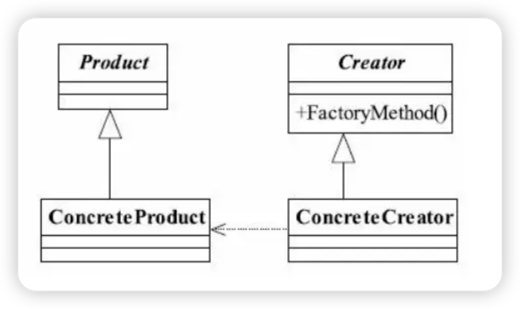

# 工厂方法模式
工厂方法模式的定义： 
> Define an interface for creating an object,but let subclasses decide which class to instantiate.Factory Method lets a class defer instantiation to subclasses.（定义一个用于创建对象的 接口，让子类决定实例化哪一个类。工厂方法使一个类的实例化延迟到其子类。）
---
工厂方法模式通用类图： 

> 在工厂方法模式中，抽象产品类Product负责定义产品的共性，实现对事物最抽象的定 义；Creator为抽象创建类，也就是抽象工厂，具体如何创建产品类是由具体的实现工厂 ConcreteCreator完成的。

> 工厂方法模式的扩展比较多，以下是比较通用的工厂方法模式实例（参考：com.codesdg.design.demo2包下）：
---

## 工厂方法模式优点：
* 好的封装性，代码结构清晰。一个对象创建是有条件约束的，如一个调用者需 要一个具体的产品对象，只要知道这个产品的类名（或约束字符串）就可以了，不用知道创 建对象的艰辛过程，降低模块间的耦合。
* 优秀的扩展性：在增加产品类的情况下，只要适当地修改具体 的工厂类或扩展一个工厂类，就可以完成“拥抱变化”。
* 屏蔽产品类的具体细节：产品类的实现如何变化，调用者都不需要关 心，它只需要关心产品的接口，只要接口保持不变，系统中的上层模块就不要发生变化。因 为产品类的实例化工作是由工厂类负责的，一个产品对象具体由哪一个产品生成是由工厂类 决定的。
* 解耦：高层模块值需要知道产品的抽象类，其他的实现类都不用关心，符合迪米特法则；也符合依赖倒置原则，只依赖产品类的抽象；同样符合里氏替换原则，使用产品子类替换产品父类。
## 工厂方法模式缺点：
* **增加复杂性** : 类的个数容易过多 , 增加系统复杂度 ; 在 添加新产品时,除了编写新的产品类之外,还要编写该产品类对应的工厂类 ;
* **增加难度** ： 增加了系统的`抽象度` 和 `理解难度`

